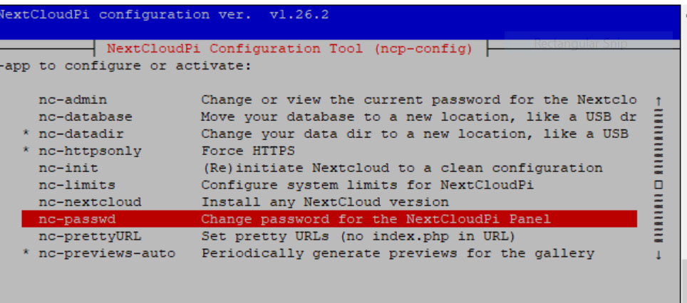
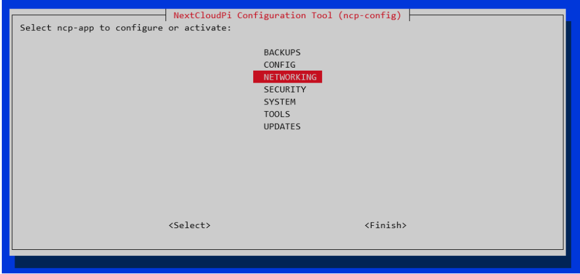

BUILD DROPBOX ALTERNATIVE WITH NEXTCLOUD
Table of content:
•	Hardware requirements
•	Software specifications
•	Setup operating system
•	Install nextcloud
•	Take next cloud sever online.
•	Challenges
•	Take this project further.

Hardware requirements:-
•	Raspberry Pi 3b+ or better
•	Micro SD card of at least 16GB or higher
•	Desktop or Monitor for setting up your Pi.
•	Keyboard and mouse are required.
•	Power supply for Raspberry Pi
We used Raspberry Pi 4b for this project, but Pi 3b can also be used. 2GB RAM Pi works fine for initial setup and basic use. The expandable memory is 32GB. You can buy a Rasberry Pi 4b from https://www.microcenter.com/product/609038/raspberry-pi-4-model-b-4gb-ddr4 (here). 
We used the microSD card for this project with 16GB storage, which works fine for us. If you want to take your nextcloud online, you should use the Pi with 4GB RAM and the storage should be at least 32GB or more.

Software Specifications:-
	The Raspberry Pi is a small, low-cost device the size of a credit card that connects to a computer monitor or television and uses a regular keyboard and mouse. It's a capable little computer that allows people of all ages to learn about computing and programming in languages such as Scratch and Python.
As we are setting up nextcloud for home use, we will be using LAN for setting up and installing nextcloud to our Pi. The ip address will be Dynamic.

As Dynamic ip keeps changing, static ip can be used instead.

Nextcloud with Dynamic ip address and LAN are not secured. 

Setup Operating System:-
	
The very first step is to setup your operating system. We are using Raspberry Pi and it is very easy to install to your tv or desktops. The Pi kit comes with the guide which you can follow or you can use internet to help you set up your Pi. Once the Pi is assembled, you can connect it to your desktop or tv and install the OS in it. 

https://projects.raspberrypi.org/en/projects/raspberry-pi-setting-up/2- -- easy guide to setup your Pi. 

Once you set up you Pi and connect it to desktop you can install the OS system you want according to the storage. We installed Debian in ours you can go with whichever you want. You can set your host name and password for your Pi for security. 

Installing Nextcloud on your Pi:-

Nextcloud is a fantastic app that lets you set up your own Google Drive at home! 
Installing Nextcloud on Raspberry Pi is quite easy. You can start your terminal and start giving the command.
Before using the url give command sudo su to work from root directory and after going to root directory give the curl command.
The sudo command allows you to run programs as another user, by default the root user. If the user is granted with sudo assess, the su command is invoked as root. Running sudo su - and then typing the user password has the same effect the same as running su - and typing the root password.

	curl -sSL https://raw.githubusercontent.com/nextcloud/nextcloudpi/master/install.sh | bash

L(upper case) is for dereference – when showing file information for a symbolic link, show the information for the file the link references rather than for the link itself. 
S(upper case) is for sorting the file by size and largest size.
s(lower case) is to print the allocated size of each file, in blocks.

a rough idea about the script.
The first command it takes a while to install the nextcloud on your device. After the Nextcloud is installed you can give another command which is ncp-config no need to type sudo as you are already in the root directory. After giving this command we can get access to nextcloud pi config file and it is a great utility and easier to set up.

You can go to nc-admin and change the admin, user, and password. Also change the password for nextcloudpi by going to nc-password. Likewise, you can get to each and every config and explore it and also change it the way you want.

More setting can be changed and updated according to your requirements.
DNS no-ip can be used so you can access your cloud out of your local area network.
After updating the setting you can got to nextcloud and enter the ip address provided to you and enter the user id and password which you created. It will take you to the home page of nextcloud where you can customize it.
Nextcloud>Settings>Add users, you can add users to your nextcloud. You can assign the username and password to the users. Also you can create groups on your cloud. 
You can also change setting on you nextcloud later. 

Take Nextcloud online:-
For taking nextcloud online, it is important to buy the domain name for security. One needs to be registered. Once your cloud is secure, you can take it online.

Challenges:-
The challenges we faced were because of not having a secure server. We were having http instead of https and due to that we were not able to open Nextcloud on our desktops. Nextcloud works fine with mobile devices within local area. To fix this problem we tried to get an secure DNS (FreeDNS.afraid.org) and also tried no-ip but it didn’t work for us, but it is worth a try.

Taking this project futher:-
First, we would like to secure our server and make it available for using even out of the local area. And later after making it secure, we can take it on the internet.
