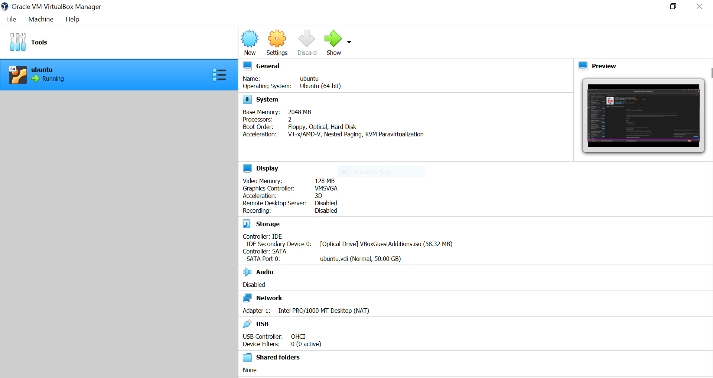
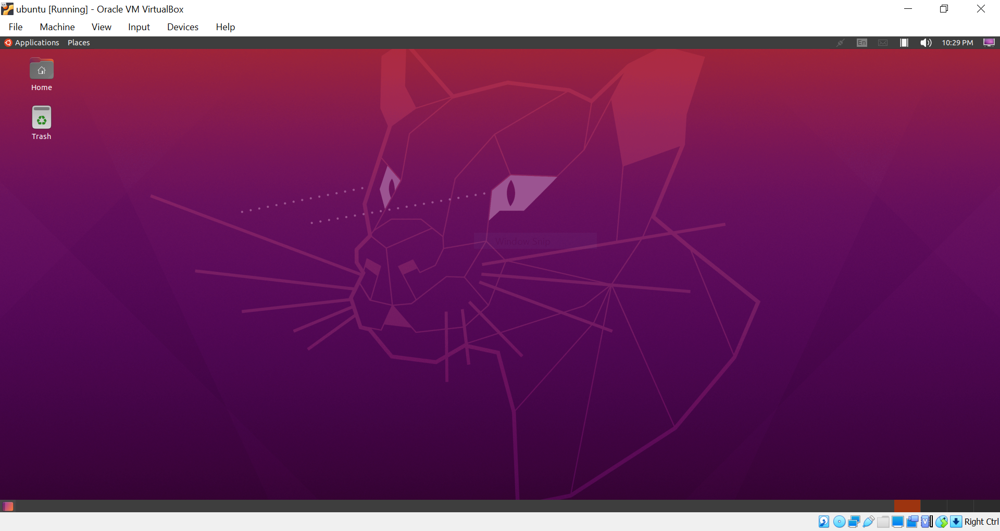
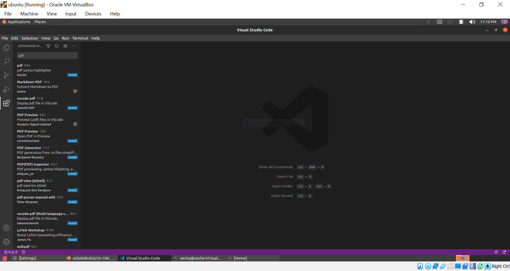

# Question 2 Screenshot

# Question 3 Screenshot

**No answer as virtual box was already installed.**

# Question 4 Screenshot

# Question 5 Screenshot

Assignment description [here](https://raw.githubusercontent.com/ra559/cis106/main/labs/lab2.md)